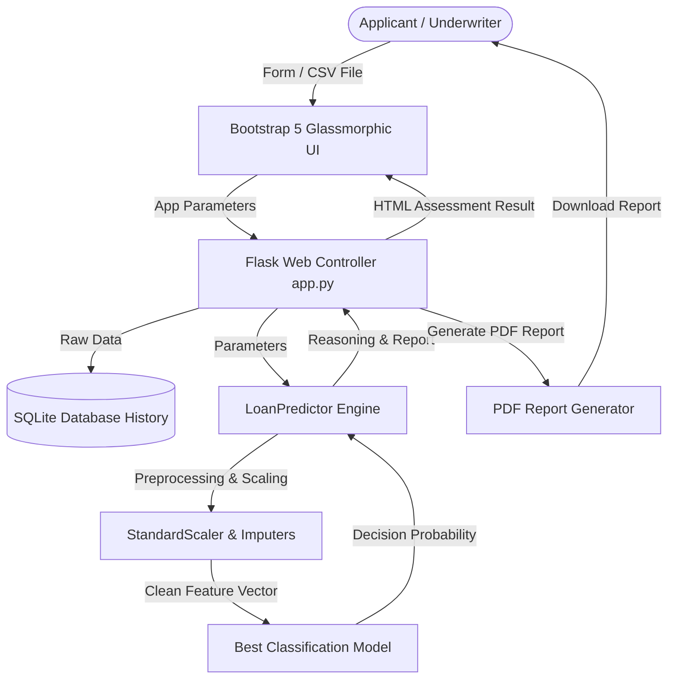
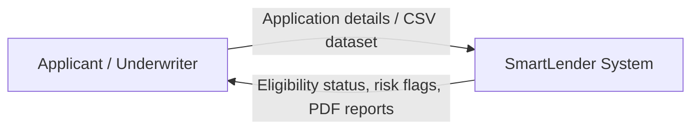
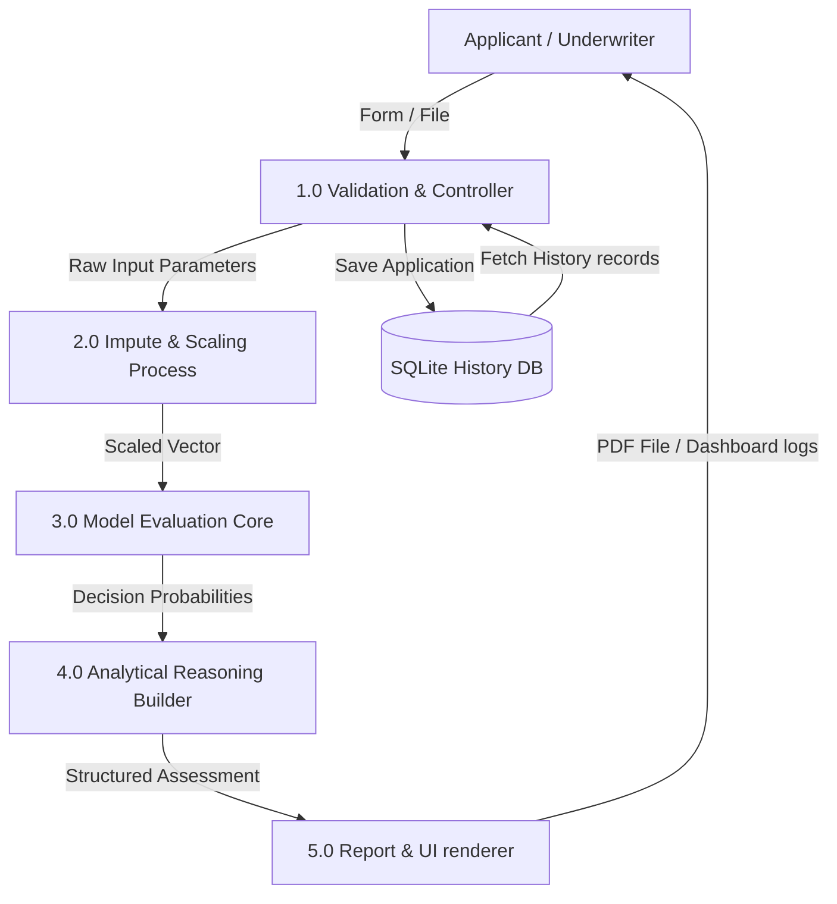
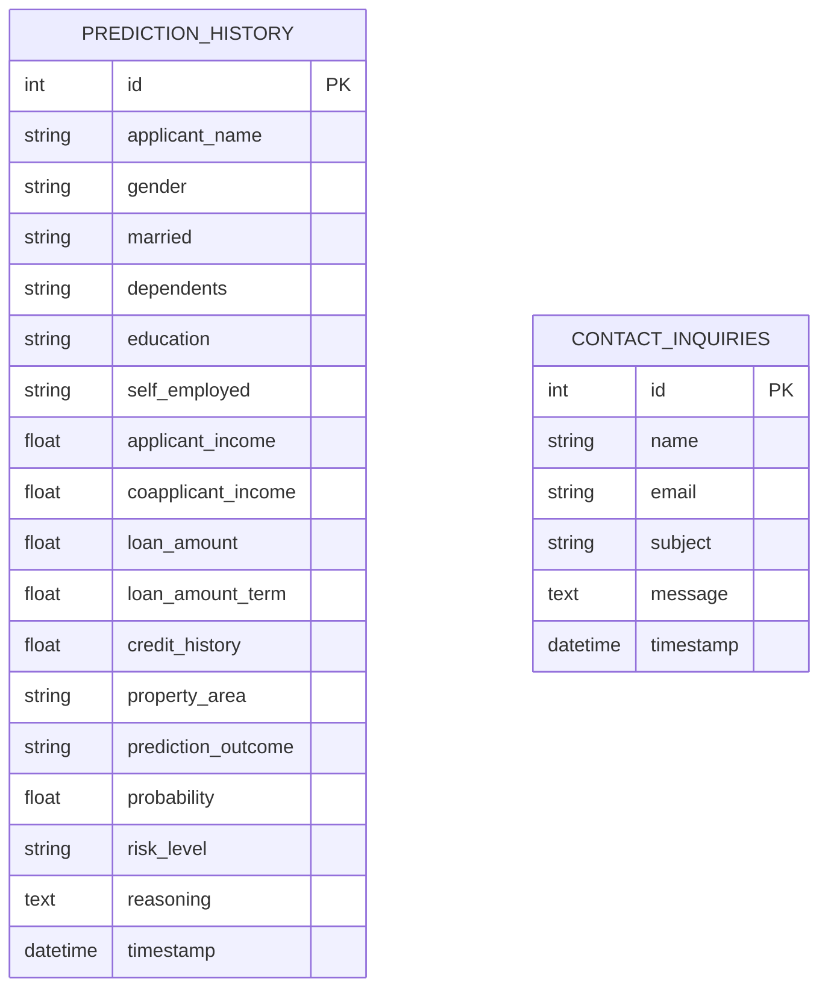
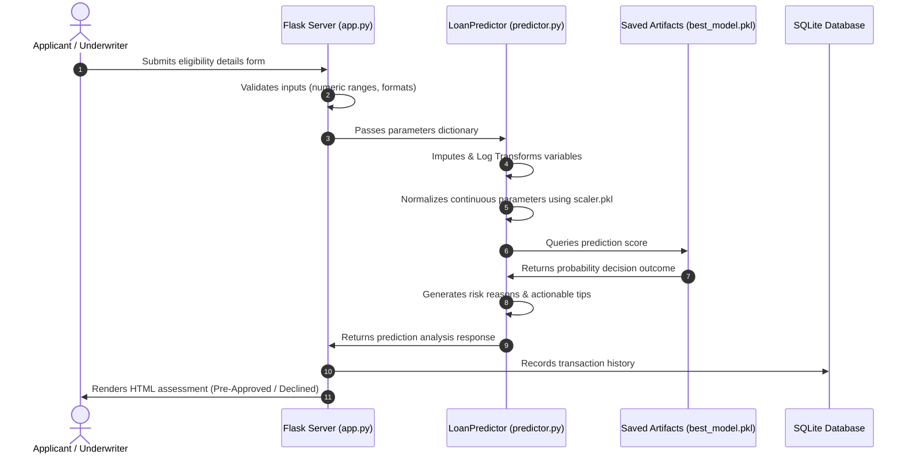

# SMART LENDER - Loan Eligibility Prediction System

SMART LENDER is a complete, production-ready, enterprise-grade automated underwriting support application. It uses multiple supervised machine learning algorithms to assess applicant risk profiles, determine pre-approval decisions, and render structured audit reasoning.

Developed as a college capstone portfolio project, the framework matches guidelines for explainable credit scoring, input verification, and secure cloud deployments.

---

## Technical Architecture & Diagrammatic Model

### System Architecture Diagram


### Flowchart Sequence

```mermaid
graph LR
    Start([Start]) --> LoadData[Load loan_data.csv]
    LoadData --> CleanDups[Drop Duplicates]
    CleanDups --> Impute[Median/Mode Imputation]
    Impute --> LogTransform[Log Transform Skewed Income/Amount]
    LogTransform --> Encoders[Label Encode & One-Hot Encode]
    Encoders --> TrainSplit[80-20 Train/Test Split]
    TrainSplit --> TrainModels[Train 8 ML Models]
    TrainModels --> Compare[Evaluate Accuracy/Recall/F1/AUC]
    Compare --> SelectBest[Select Optimal Model by F1-Score]
    SelectBest --> SaveArtifacts[Save best_model.pkl & scaler.pkl]
    SaveArtifacts --> End([Pipeline Completed])
```


### Use Case Diagram
```mermaid
left_to_right_direction
actor Customer as "Customer / Applicant"
actor Underwriter as "Bank Officer / Underwriter"

rectangle SmartLenderSystem {
    usecase UC1 as "Single Loan Assessment"
    usecase UC2 as "Batch CSV Upload Prediction"
    usecase UC3 as "Download Assessment Report (PDF)"
    usecase UC4 as "Search Prediction Database Logs"
    usecase UC5 as "Compare ML Algorithms Performance"
    usecase UC6 as "Manage Database entries"
    usecase UC7 as "Submit Inquiries Form"
}

Customer --> UC1
Customer --> UC3
Customer --> UC7

Underwriter --> UC1
Underwriter --> UC2
Underwriter --> UC3
Underwriter --> UC4
Underwriter --> UC5
Underwriter --> UC6
```

### Data Flow Diagram Level 0


### Data Flow Diagram Level 1


### Entity Relationship Diagram (ERD)


### Sequence Diagram


---

## Directory Folder Structure

```text
smartlender project/
├── app.py                      # Main entrypoint
├── requirements.txt            # Python dependencies
├── Procfile                    # Deployment execution instructions
├── runtime.txt                 # Specified python environment
├── README.md                   # Project documentation
├── PROJECT_REPORT.md           # Extensive analysis, installation, and APIs
├── data_generator.py           # Generation of dataset
├── train_model.py              # ML preprocessing and visual charts builder
├── config.py                   # System config parameters
├── dataset/
│   └── loan_data.csv           # Synthesized loan records
├── models/
│   ├── best_model.pkl          # Serialized classification model
│   ├── scaler.pkl              # Normalization StandardScaler
│   ├── encoders.pkl            # Encoders & Modes map dictionary
│   └── feature_columns.pkl     # Feature index columns structure
├── static/
│   ├── css/
│   │   └── style.css           # Custom CSS styling (dark mode support)
│   ├── js/
│   │   └── main.js            # Validation, loaders, toast alerts
│   └── images/
│       └── eda/                # Visual distributions and plots
├── templates/
│   ├── base.html               # Head template
│   ├── index.html              # Landing home
│   ├── about.html              # Pipeline details
│   ├── predict.html            # Input tabs
│   ├── result.html             # Analysis and scoring outcome
│   ├── dashboard.html          # Stats and model comparison matrices
│   ├── faq.html                # Searchable FAQ accordion
│   ├── contact.html            # Contact forms
│   ├── admin.html              # Records tables and deletes
│   └── 404.html                # 404 page
└── utils/
    ├── db_helper.py            # SQLite schemas
    ├── predictor.py            # Inference engine
    └── report_generator.py     # PDF creator using fpdf2
```

---

## Getting Started

### Prerequisites
- Python 3.9+ or Python 3.10+
- Pip package manager

### 1. Installation
Clone or navigate to the workspace directory and run:
```bash
pip install -r requirements.txt
```

### 2. Generate Dataset and Train Models
Run the generation and training pipeline script. This will prepare data, train all 8 models, evaluate metrics, and save artifacts:
```bash
# Generate mock dataset
python data_generator.py

# Train models & construct EDA charts
python train_model.py
```

### 3. Run Locally
Start the Flask application server:
```bash
python app.py
```
Open a browser and navigate to `http://127.0.0.1:5000/`.

---

## REST API Documentation

### Assess Loan Eligibility
* **Endpoint**: `/api/predict`
* **Method**: `POST`
* **Headers**: `Content-Type: application/json`
* **Payload Structure**:
```json
{
  "applicant_name": "Sarah Miller",
  "Gender": "Female",
  "Married": "No",
  "Dependents": "0",
  "Education": "Graduate",
  "Self_Employed": "No",
  "ApplicantIncome": 6200.0,
  "CoapplicantIncome": 0.0,
  "LoanAmount": 150.0,
  "Loan_Amount_Term": 360.0,
  "Credit_History": 1.0,
  "Property_Area": "Semiurban"
}
```

* **Response Status**: `200 OK`
* **Response Body**:
```json
{
  "status": "success",
  "prediction": "Y",
  "probability": 0.894,
  "risk_level": "Low",
  "reasoning": "Applicant has a positive credit history, demonstrating low historical default risk. Strong Debt-to-Income (DTI) ratio of 24.2%. Property located in a Semiurban area.",
  "suggestions": [
    "Proceed with submitting official salary slips and properties documentation for final processing."
  ],
  "prediction_id": 1,
  "is_fallback": false
}
```

---

## Cloud Deployment Instructions

### Render Deployment
1. Create a Web Service linked to your Git repository.
2. Select Environment: **Python**.
3. Set Build Command: `pip install -r requirements.txt && python data_generator.py && python train_model.py`
4. Set Start Command: `gunicorn app:app`

### Railway Deployment
1. Import project repository into Railway.
2. Railway automatically detects `Procfile` and builds the service.
3. Verify that the start command points to `gunicorn app:app`.

### IBM Cloud Deployment
1. Create a manifest file `manifest.yml`:
```yaml
applications:
  - name: smartlender-assessment-portal
    memory: 256M
    instances: 1
    buildpack: python_buildpack
```
2. Log in and target resources: `ibmcloud login` and `ibmcloud target --cf`.
3. Trigger push command: `ibmcloud cf push`.
